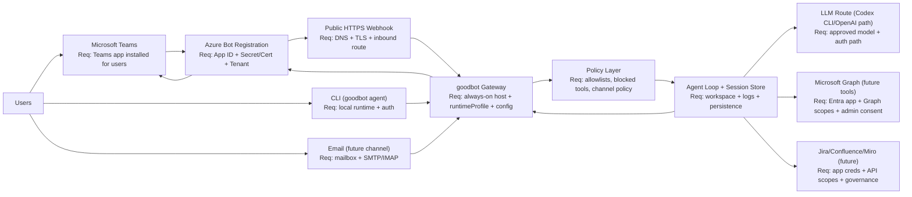
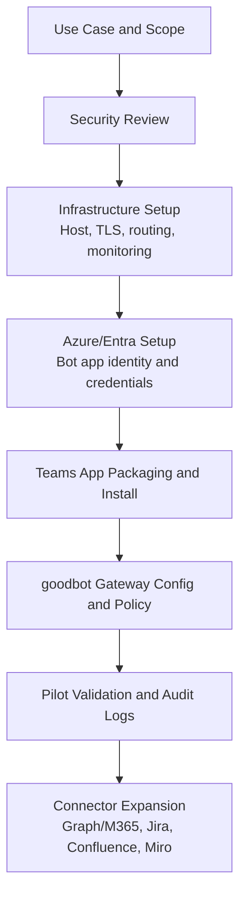

# Enterprise Integration Architecture (Draft)

This draft is intended for stakeholder alignment (Product, Infrastructure, and Security) before full connector implementation.

## 1) End-to-End Architecture

## 2) Enablement Sequence

## 3) Node Requirements

| Node | Owner (typical) | What must be enabled |
|---|---|---|
| Microsoft Teams | Collaboration / Workspace Admin | Teams app package upload + bot availability in target scopes (DM/team/channel). |
| Azure Bot Registration | Identity / Platform | Bot App ID, tenant binding, secret/certificate lifecycle, Teams channel enabled. |
| Public HTTPS Webhook | Infrastructure / Network | Reachable endpoint from Microsoft cloud, trusted TLS cert, firewall/routing rules, stable URL. |
| goodbot Gateway Runtime | Platform / App Team | Long-running process (container/VM), restart policy, secured config, observability. |
| Runtime Policy Layer | Security + App Team | Deny-by-default channel/tool policy, allowlists, profile constraints, change control. |
| Agent + Session State | App Team | Persistent workspace/state path, retention policy, incident/logging hooks. |
| LLM Route (Codex/OpenAI path) | App Team + Security | Approved model/provider path, auth mechanism, usage limits, auditability. |
| Microsoft Graph (future) | Identity / Security | Entra app registration, minimum Graph scopes, admin consent, mailbox/site scoping. |
| Jira/Confluence/Miro (future) | Tool Owners + Security | App/service account credentials, per-product scopes, data-handling approvals. |
| Email Channel (future) | Messaging Admin + Security | IMAP/SMTP connectivity, account policy approval, sender restrictions, retention controls. |

## 4) Current vs Planned Scope

- Current (implemented in fork):
  - CLI path.
  - Teams live channel MVP path (webhook-based) with gateway profile/policy controls.
- Near term (planned):
  - Teams pilot hardening (tenant rollout, stronger auth/validation, operational runbook).
  - Calendar workflow capability (availability proposal + confirmation-based booking).
- Future (planned):
  - M365/Outlook tool integration over Microsoft Graph.
  - Additional enterprise connectors (Jira, Confluence, Miro).
  - Optional additional channels such as email.

## 5) Decision Guidance

- Do not block architecture communication on full connector implementation.
- Use this draft for cross-team planning now; update it after each milestone that changes auth, routing, or required permissions.
